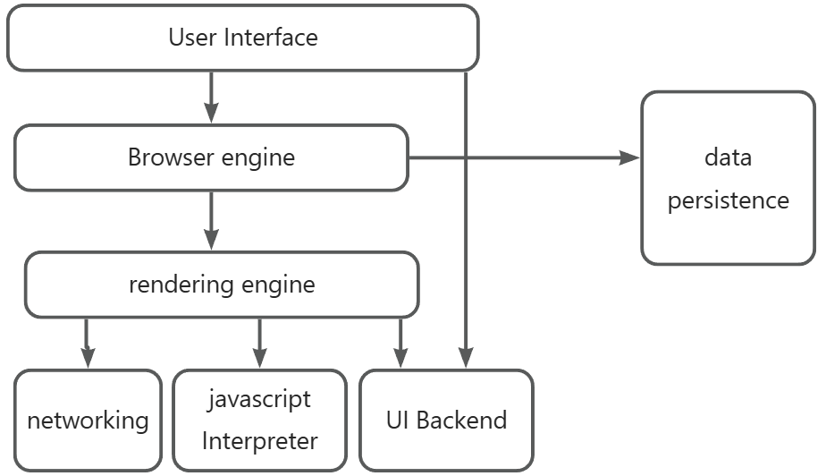
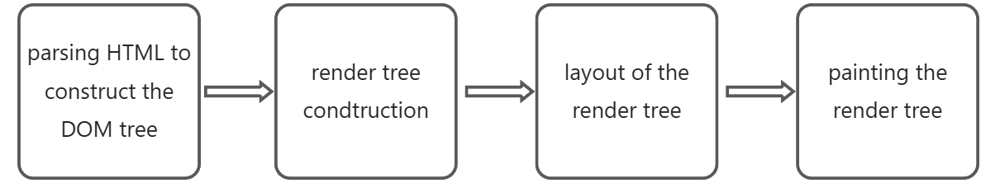
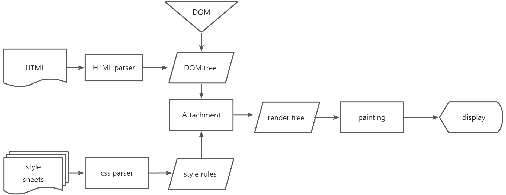
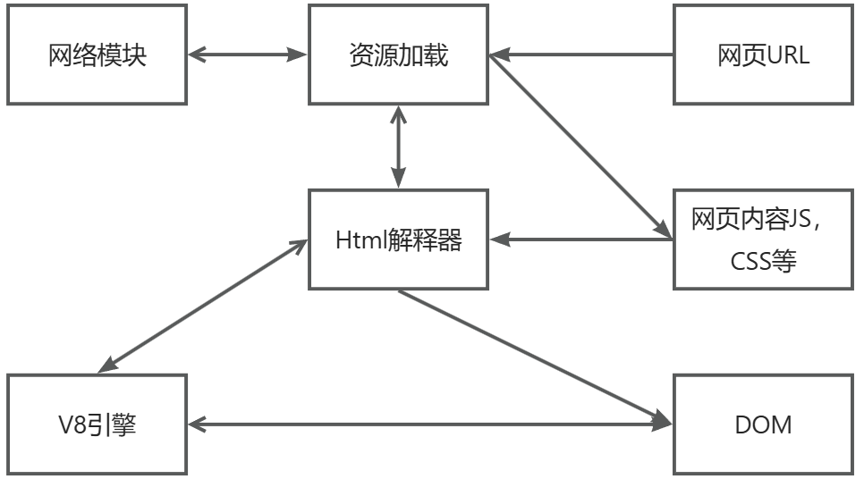
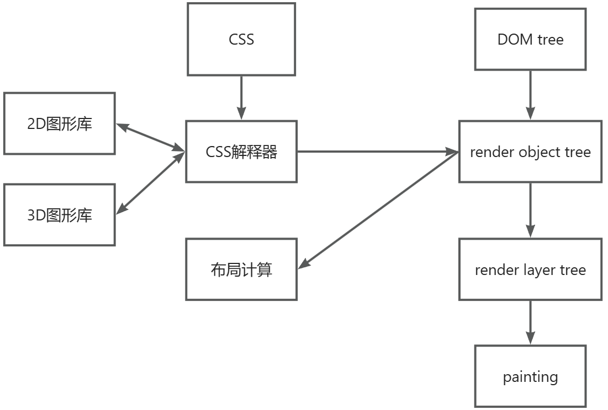
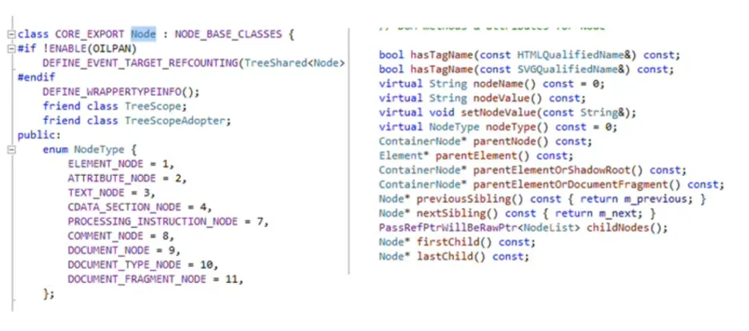

# browser

+ 用户界面一 包括地址栏、后退/前进按钮、书签目录等
+ 浏览器引l擎一 用来查询及操作渲染引擎的接口
+ 渲染引擎一 用来显示请求的内容，例如，如果请求内容为html，它负责解析html 及css，井将解析后的结果显示出来
+ 网络一 用来完成网络调用，例如http请求，它具有平台无关的接口，可以在不同平台上工作
+  UI 后端一用来绘制类似组合选择框及对话框等基本组件，具有不特定于某个平台的通用接口，底层使用操作系统的用户接口
+ JS解释器一 用来解释执行JS代码
+  数据存储— 属于持久层，浏览器需要在硬盘中保存类似cookie的各种数据。

#### 网页可视化过程
> 网页可视化：就是根据描述或者定义构建数学模型，通过模型生成图像的过程。
>

解析html以构建dom树 -> 构建render树 -> 布局render树 (layout tree）-> 绘制render树

##### Webkit 的渲染过程

##### Bilnk的渲染过程

对于前端开发的启示：

+ 尽量减少HTTP请求次数
+ 减少DNS查找次数
+ 资源加载的速度不会影响DON树的建立，因为他们都是异步的。但js的URL除外，如果可以，请尽可能地使用<script async >/script>
+ 如果js可能改变DOM，导致RenderOb ject树重新绘制，请尽可能提前加载
+ 如果js不会与DON丁交道，可以采用延迟加载

#### HTML简单介绍与HTML5新特性
什么是HTML?

+ HTML 是用来描述网页的一种语言。
+ HTML 指的是超文本标记语言(Hyper Text Markup Language)
+ HTML 不是一种编程语言，而是一种标记语言 (markup language)，标记语言是一套标记标签 (markup tag)
+ HTML 使用标记标签来描述网页

##### HTML.5新特性：
+ 离线 (offline) : application cache、localstorage, Indexed DB
+ 存储( storage ) : application cache、localstorage, indexed DB
+ 连接 (connectivity)：web sockets, server-sent事件文件访问 (file access) : file api、 filesystem. fileWriter, progressEvents
+ 语义 (semantics)：Media、link relation等，音频/视频 (audio/video) : HTML5 video、webaudio、webRTC、video track等
+ 3D/图形(30/graphics)：canvas 2D、3D css变换、WebGL、sVG等
+ 展示 (presentation)：CSS3 20/31变換、转换(transition） 、webfont.s等
+ 性能 (performance) : web worker、http caching
+ 其他 (Nuts and bolts)：触控、shadow DON等

#### DOM模型简单介绍
什么是 DOM?

+ DOM是Document Object Nodel （文档对象模型）的缩写。
+ DOM是W3C的标准。
+ DOM 定义了访问HTML 和XML 文档的标准：
+ DON是中文于平台和语言的接口，态地访问和更新文档的内容、结构和样式。

忘公许程序和脚本动

W3C DOM 标准被分为 3个不同的部分：

+ 核心 DOM 一针对任何结构化文档的标准模型
+ XML DON 一针对XML 文档的标准模型
+ HTML DOM 一 针对 HTM 文档的标准模型

##### DON节点：
根据 W3C 的HTML DOM 标准，HTML 文档中的所有内容都是节点：

+  整个文档是一个文档节点
+  每个 HTML 元素是元素节点
+  HTML 元素内的文本是文本节点
+  每个HTML 属性是属性节点
+  注释是注释节点

DON节点 Bink核中的定义：

