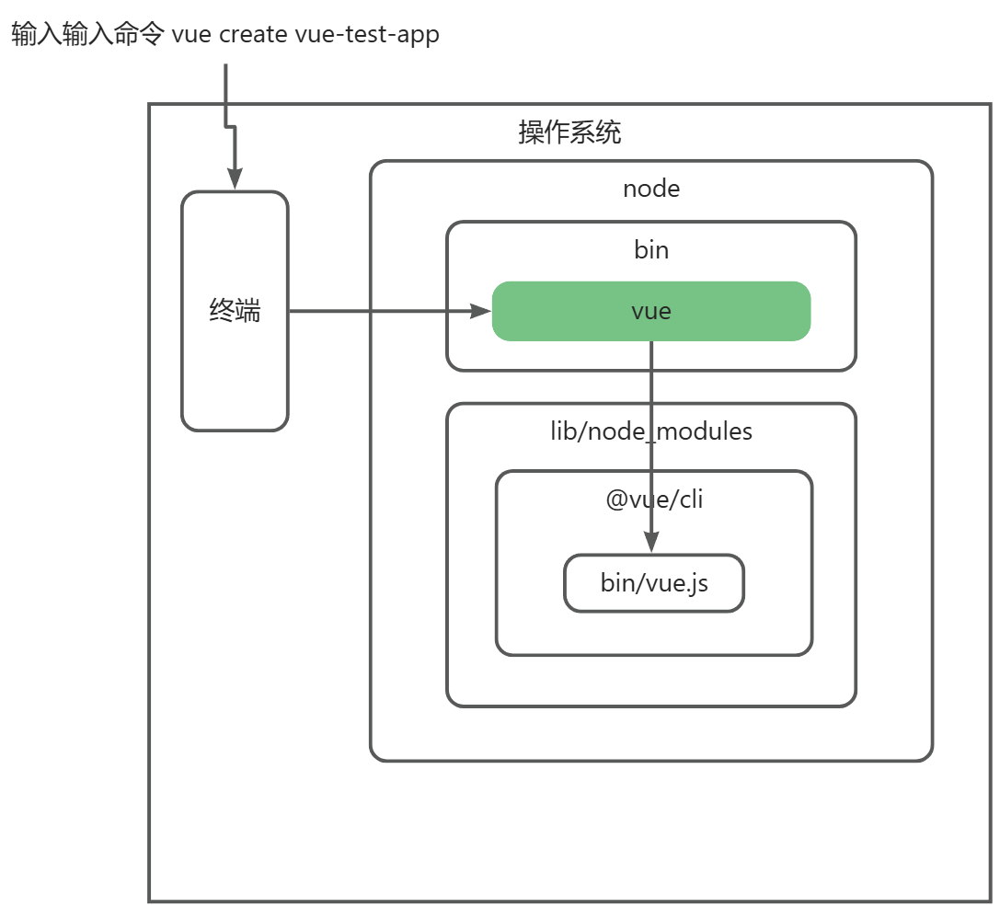
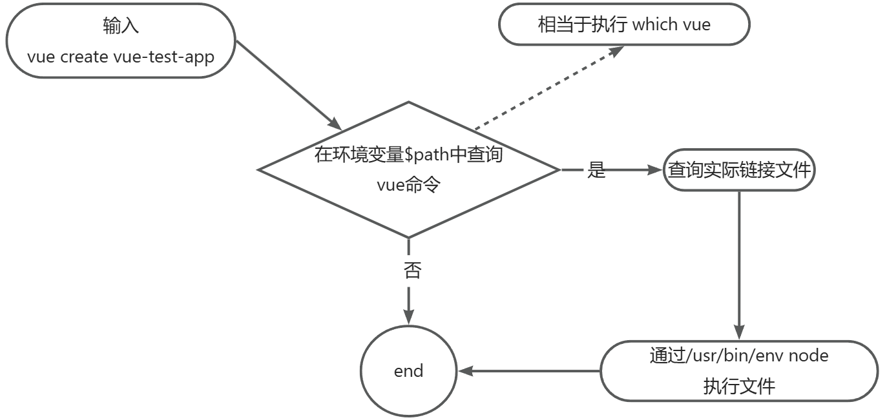

# cli

脚手架本质是一个系统操作系统的客户端，通过命令执行如：  
`vue create vue-test-app --force`  
主命令：`vue`  
command:`create`  
command的param:`vue-test-app`  
配置:`--force`  
`where vue` 查找命令的绝对路径相当于linux which命令 



## 脚手架的执行原理： 
    - 在终端输入 `vue create vue-test-app`
    - 终端解析出 `vue`命令
    - 终端环境变量中找到`vue`命令
    - 终端利用`node`执行`vue.js`
    - `vue.js`解析`command / options`
    - `vue.js`执行`command`
    - 执行完毕，退出执行
  

## 为什么全局安装完`vue-cli` 会有一个vue命令？
  
	在`package.json`中`bin`目录配置了，`node`会在`bin`目录下配置一个对应的软连接  
`#!/usr/bin/env node`告诉我们的操作系统，在调用这个文件时去环境变量中找`node`命令，用`node`命令执行这个文件 

## 全局安装vue-cli时发生了什么？ 
    - 先把@vue/cli下载到/usr/local/lib/node_modules中，然后根据@vue/cli下的package.json，根据bin中的定义去/usr/local/bin/下去定义@vue/cli的软连接vue

##  执行vue命令时发生了什么？为什么vue指向一个js文件，我们可以直接通过vue命令执行它？ 
    - 终端在环境变量中找vue指令（相当于which vue命令），看有没有被注册，未注册则返回command not found,注册了则去找vue指令软连接指向的地址/usr/local/lib/node_modules/@vue/cli/bin/vue.js，去执行vue.js文件中的代码
    - 因为这个js文件的顶部写了#!/usr/bin/env node,标识在环境变量中查找node，告诉系统使用node去执行这个js文件

## 为什么说脚手架本质是操作系统的客户端？它和我们PC上安装的应用软件有什么区别？ 
    - node在window中是一个node.exe，在Mac中是一个可执行文件（node*）,因为node是操作系统的一个客户端，脚手架的本质是通过node去执行js文件，所以也可以说脚手架的本质是操作系统的客户端。
    - 本质来说没有区别，PC安装的应用只是提供了一个GUI，脚手架是通过命令的形式

## 如何为node脚手架命令创建别名？ 
    - 进入/usr/local/bin目录 linux `ln -s ./imooc-test-cai imooc-test-cai2` window  `mklink /J D:\target-dir E:\src-dir`

##  描述脚手架命令执行的全过程 
    - 输入`vue create vue-test-app`,在环境变量path中查找vue命令，查询实际链接文件，通过`/usr/bin/env node` 执行文件(usr/bin 相当于/windows/System32)

##  `npm publich`  
```plain
404 Not Found - PUT https://registry.npmjs.org/lp-zk - Not found
//未登录或者登录信息不正确
403 Forbidden - PUT https://registry.cnpm.cspiretech.com/lp-cli - [no_perms] 
//npm未完成邮箱验证，根据提示信息操作就可以
```

## 脚手架本地`link`的标准流程 
    - `npm link / unlink`把当前项目连接到node全局的node_modules中作为一个库文件，并解析bin配置创建可执行文件
    - `npm link lp-lib`将当前项目中`node_modules`下指定的库文件链接到node全局node_modules下的库文件
    - `process`node进程 可以获取或者修改当前node进程的设置


