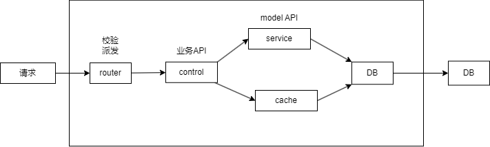

# 技术选型

抛开对框架的成见,要让它们平等的为你服务,只要最合适的,不要秀技术; 要考虑各种成本,学习成本,开发成本,运维成本;
主要看业务需求,研发成本和效率,稳定性;

## node框架选型

- Koa2 和 Express
- Egg.js
- Nest.js

koa脚手架: koa-generator

## 数据库选型

- Mysql 和 Sequelize
- Mongodb 和 Mongoose
- redis

- JSON 数据存储作品内容 -> mongodb
- 作品的其他信息,用户信息, 适合用表格 -> Mysql
- 缓存,复杂业务 -> redis

### Mysql 和 Sequelize

## 登录校验

## 单元测试和接口测试

## 线上服务

